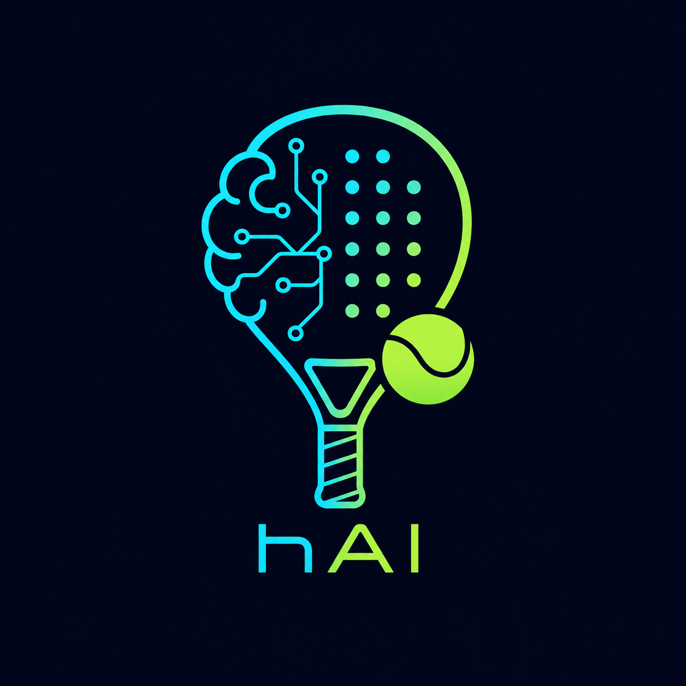

# hAI Padel Americano 🎾🧠

> Ein schlanker Turnier-Manager für **Padel Americano** – ideal für Vereine, Schulen und Freundeskreise.

<p align="center">
  
</p>

<p align="center">
  
  
  
</p>

<p align="center">
  
  
</p>

---

## ✨ Funktionen

- 🎲 **Americano-Auslosung** – automatische Runden mit Doppel-Teams.
- 📋 **Match-Verwaltung** – Punkte pro Match und Platz eintragen.
- 🧮 **Live-Rangliste** – Einzelwertung nach Punkten, Spielen und Differenz.
- 🖥️ **Monitor-Modus** – Vollbild-nahe Anzeige für TV/Beamer.
- 💾 **JSON Import/Export** – Turniere lokal sichern und später wieder laden.
- 🌐 **100 % statisch** – läuft komplett im Browser.

---

## 🚀 Schnellstart

### 1. Repository klonen

```bash
git clone https://github.com/jbkunama1/hAI.PadelAmericano.git
cd hAI.PadelAmericano
```

### 2. Lokal starten

Variante A – direkt öffnen:

- `index.html` im Browser öffnen.

Variante B – kleiner HTTP-Server:

```bash
python3 -m http.server 8000
```

Dann im Browser:

```text
http://localhost:8000/index.html
```

---

## 📦 Projektstruktur

```text
hAI.PadelAmericano/
├── index.html      # Web-App (UI + Logik)
├── README.md       # README (Deutsch)
├── README_en.md    # README (Englisch)
├── LICENSE
└── .gitignore
```

---

## 🧠 Americano-Logik (kurz erklärt)

- Gespielt wird im **Doppel**, gewertet wird **individuell**.
- Die App erzeugt mehrere Runden mit zufällig verteilten Partnern und Gegnern.
- Ist die Spielerzahl nicht durch 4 teilbar, hat pro Runde eine Person Pause.
- Nach jedem Match werden die Punkte auf die beteiligten Spieler verteilt.
- Die Rangliste sortiert nach Gesamtpunkten, Spielen und Punktedifferenz.

Die Auslosung ist heuristisch – sie versucht eine faire Durchmischung, garantiert aber kein perfektes mathematisches Rundenschema.

---

## 📜 Lizenz (MIT)

Dieses Projekt soll unter der **MIT-Lizenz** veröffentlicht werden. Die MIT-Lizenz ist eine sehr freizügige Open-Source-Lizenz, die die Nutzung, Veränderung und Weitergabe des Codes mit wenigen Auflagen erlaubt – wichtig ist vor allem, dass Urheberrechtshinweis und Lizenztext erhalten bleiben. [web:46][web:47][web:50][web:53][web:56][web:59]

Der vollständige Lizenztext befindet sich in der Datei `LICENSE`.
